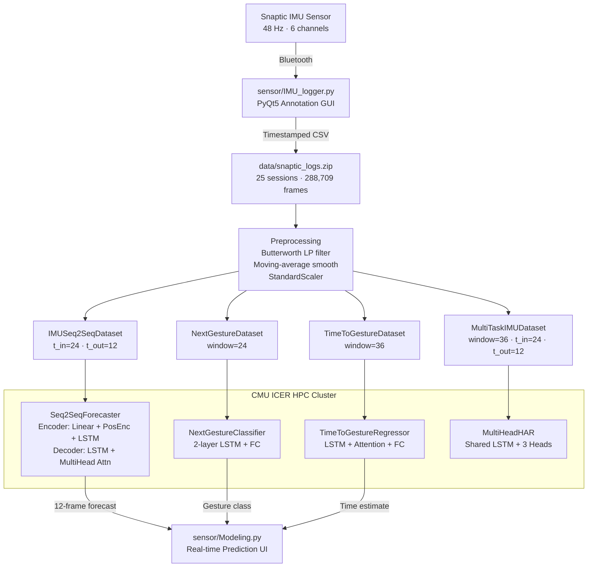

# MetaMotion-Net

**IMU-based gesture forecasting, classification, and time-to-gesture prediction for low-latency VR/metaverse interaction.**

> Developed at Central Michigan University in collaboration with Prof. Patrick Seeling.

---

## Project Overview

MetaMotion-Net is an end-to-end deep learning pipeline built on top of a custom-collected IMU dataset from a Snaptic wearable sensor. The system addresses a fundamental problem in VR and metaverse environments: **motion-to-avatar latency** — the delay between a user's physical movement and the avatar's rendered response.

The pipeline covers three complementary prediction tasks:

| Task | Model | Output |
|---|---|---|
| IMU Sequence Forecasting | Seq2Seq (LSTM + Multi-head Attention) | Next 12 frames of 6D sensor data |
| Next-Gesture Classification | LSTM Classifier | Which gesture comes next (4 classes) |
| Time-to-Gesture Prediction | LSTM Regressor | How many frames until the next gesture |

---

## Motivation

In VR and extended reality (XR) applications, IMU sensors embedded in controllers, gloves, or wristbands are the primary source of motion data. These sensors capture **3-axis accelerometer** and **3-axis gyroscope** readings at high frequency.

The central challenge is **motion-to-avatar latency**: by the time a raw sensor reading is processed, rendered, and displayed, the user's physical gesture has already progressed. Even at 48 Hz, a pipeline that waits for motion to complete before responding introduces perceptible lag.

**MetaMotion-Net addresses this by predicting what the user will do before they do it:**

- The **Seq2Seq forecaster** extrapolates the raw IMU signal 12 frames (~250 ms) into the future, giving the rendering engine a head start.
- The **next-gesture classifier** identifies which discrete gesture the user is about to perform, enabling context-aware pre-rendering.
- The **time-to-gesture regressor** estimates how many frames away the gesture onset is, enabling adaptive scheduling of compute resources.

---

## Dataset

The dataset was collected in-house using a **Snaptic IMU wearable** sampled at **48 Hz**, producing continuous 6-channel recordings with per-frame gesture annotations.

| Property | Value |
|---|---|
| Recording sessions | 25 |
| Total IMU frames | 288,709 |
| Sample rate | 48 Hz |
| Sensor channels | 6 (acc\_x, acc\_y, acc\_z, gyro\_x, gyro\_y, gyro\_z) |
| Gesture classes | 4 |
| Annotation format | Per-frame label in CSV |

**Gesture vocabulary:**

| Label | Class index |
|---|---|
| `no_gesture` | 0 |
| `swipe_up` | 1 |
| `swipe_left` | 2 |
| `swipe_right` | 3 |

**Class imbalance:** The overwhelming majority of frames are labeled `no_gesture`. Gesture events (swipe\_up, swipe\_left, swipe\_right) are sparse relative to the baseline, which creates a significant class imbalance challenge for the classifier and regressor tasks. This was a known limitation during experimentation and is addressed in Future Work.

---

## Data Collection Pipeline

Data was collected using a custom-built **PyQt5 desktop application** (`sensor/IMU_logger.py`) that streams raw IMU packets from the Snaptic device over Bluetooth and writes them to timestamped CSV files.

**Workflow:**

1. **Connect** — The application discovers the Snaptic device via `PySnapticSDK`, connects over Bluetooth, and begins streaming IMU packets.
2. **Stream** — Each packet delivers a 6D vector `[acc_x, acc_y, acc_z, gyro_x, gyro_y, gyro_z]` at 48 Hz. Packets are written row-by-row to a CSV file.
3. **Annotate** — A gesture dropdown and one-shot button allow the operator to arm a gesture label. The label is written to exactly one CSV row (the next packet), then automatically resets to `no_gesture`. This prevents label smearing across multiple frames.
4. **Preprocess** — Each packet is simultaneously appended to a rolling deque of `WINDOW_SIZE = 127` frames. When the buffer is full, a 4th-order Butterworth low-pass filter (15 Hz cutoff) and a 5-point moving average smoother are applied before inference.

**Engineering challenges encountered:**

- **Label timing precision**: Gestures execute over multiple frames, but a single-frame label is used to mark onset. Forward-filling and label expansion heuristics were used downstream to handle this during dataset construction.
- **Bluetooth packet ordering**: IMU packets arrive in bursts. The worker thread processes all packets per polling cycle before sleeping 20 ms, preserving temporal ordering.
- **Sensor noise**: Raw accelerometer data from the Snaptic sensor contains significant high-frequency noise, necessitating low-pass filtering before any model inference.

---

## Model Architecture

### 1. Seq2Seq IMU Forecaster

**File:** `src/models/seq2seq_forecaster.py`, `src/models/shared_layers.py`

**Purpose:** Given a 24-frame window of 6D IMU data, forecast the next 12 frames.

The encoder projects each 6D input frame into a 128-dimensional embedding, applies sinusoidal positional encoding, and processes the sequence through a 2-layer LSTM. The decoder runs autoregressively: at each of 12 decoding steps, it takes the previous decoder hidden state and the encoder output sequence, runs a decoder LSTM step, then applies multi-head attention (8 heads) over the encoder outputs to form a context vector, from which the next 6D frame is predicted.

During training, **teacher forcing** is applied with a probability that decays exponentially from 0.5 toward 0.1, encouraging the model to rely on its own predictions over time. An **exponential moving average (EMA)** of model weights (decay = 0.99) is maintained and used for validation to reduce evaluation noise.

**Key hyperparameters** (`config/train_config.json`):

| Parameter | Value |
|---|---|
| `d_model` / `hidden_dim` | 128 |
| `num_layers` | 2 |
| `num_heads` | 8 |
| `t_in` (input frames) | 24 |
| `t_out` (forecast frames) | 12 |
| Window size | 36 |
| Stride | 6 |
| Learning rate | 0.001 |
| Max epochs | 100 |
| Batch size | 32 |

**Loss:** MSE with gradient clipping (max norm 1.0). LR scheduler: `ReduceLROnPlateau` (factor 0.5, patience 5). Early stopping (patience 10).

---

### 2. Next-Gesture Classifier

**File:** `src/models/next_gesture_classifier.py`

**Purpose:** Given a 24-frame IMU window, classify which gesture the user will perform next (4-class output).

A 2-layer LSTM (hidden dim 128) reads the input sequence, and the last hidden state is passed through a linear layer to produce 4 logits. The dataset construction logic (`src/dataset/next_gesture_dataset.py`) scans the label sequence for gesture onsets and assigns each frame a label equal to the class of the next upcoming gesture, ensuring every frame carries a meaningful future-gesture target.

**Key hyperparameters:**

| Parameter | Value |
|---|---|
| `hidden_dim` | 128 |
| `num_layers` | 2 |
| `num_classes` | 4 |
| `window_size` | 24 |
| Learning rate | 0.001 |
| Epochs | 20 |
| Batch size | 32 |

**Loss:** Cross-entropy.

---

### 3. Time-to-Gesture Regressor

**File:** `src/models/time_to_gesture_regressor.py`, `src/train/train_time_to_gesture.py`

**Purpose:** Given a 36-frame IMU window, predict how many frames until the next gesture onset (normalized to [0, 1] over a maximum horizon of 200 frames).

A single-layer LSTM with an attention mechanism over its output sequence produces a context vector, which is passed through a fully connected layer to produce the scalar time-to-gesture estimate.

**Key hyperparameters:**

| Parameter | Value |
|---|---|
| `hidden_dim` | 128 |
| `num_layers` | 2 |
| `window_size` | 36 |
| `max_time` | 200 frames |
| Learning rate | 0.001 |
| Epochs | 25 (up to 50) |
| Batch size | 32 |

**Loss:** Smooth L1 (Huber) with gradient clipping. LR scheduler: `ReduceLROnPlateau`. Early stopping (patience 7).

---

### 4. Multi-Task Model (MultiHeadHAR)

**File:** `src/models/multihead_har_model.py`, `src/train/har_train_test1.py`

**Purpose:** A unified model that jointly solves all three tasks from a shared LSTM backbone.

A shared 2-layer LSTM encoder processes the input window. Its final hidden state is branched into three task-specific heads:
- **Head 1 — Seq2Seq Forecaster**: an autoregressive decoder LSTM produces 12 future frames.
- **Head 2 — Gesture Classifier**: a linear layer produces 4-class logits.
- **Head 3 — Time Regressor**: a linear layer produces a scalar time estimate.

The combined training loss is a weighted sum: `L = 1.0 × MSE_seq + 2.0 × CE_cls + 0.5 × MSE_ttg`.

---

## System Architecture



---

## Experimental Setup

| Setting | Value |
|---|---|
| Framework | PyTorch |
| Hardware | NVIDIA V100 GPU (CMU ICER SLURM cluster) |
| Input dim | 6 (3-axis accel + 3-axis gyro) |
| Input window | 24 frames (Seq2Seq, Classifier) / 36 frames (Regressor, MultiHead) |
| Forecast horizon | 12 frames (~250 ms at 48 Hz) |
| Max regression horizon | 200 frames (~4.2 s) |
| Scaler | `sklearn.preprocessing.StandardScaler` (fit on training split) |
| Optimizer | Adam |
| Grad clipping | 1.0 (Seq2Seq and Regressor) |
| Train/Val/Test split | 70% / 15% / 15% (MultiHead) · 80% / 20% (Seq2Seq, Regressor) |
| Random seed | 42 |

Jobs were submitted via SLURM batch scripts (`.sb`) on the CMU ICER `general-short` and `scavenger` GPU partitions. GPU utilization was monitored via `nvidia-smi` and logged to `gpu_usage.log`.

---

## Results

**Multi-task training** (`har_train_test1.py`) on 22 CSV sessions produced the following convergence:

- **Best validation loss**: ~0.39 (combined weighted loss, achieved around epoch 28)
- The model saves its best checkpoint to `multitask_best.pt` via early stopping.

**Seq2Seq forecasting** (`train03.py`, `src/train/seq2seq_train.py`):
- Trained with dynamic teacher forcing decaying from 0.5 → 0.1 per epoch.
- Best model saved to `best_seq2seq_model.pt` via early stopping (patience 10).
- EMA weights (decay 0.99) used for validation evaluation.

**Real-time inference** is demonstrated in `sensor/Modeling.py`, which streams live IMU data from the Snaptic sensor, runs the Seq2Seq model every 6 samples (stride), and overlays predicted vs. actual signals for a user-selected channel in a live `pyqtgraph` plot.

---

## Limitations

- **Class imbalance**: The `no_gesture` class represents the large majority of frames (~95%+). Gesture events are rare, which makes the classifier and regressor prone to predicting the majority class. Oversampling, weighted loss, or focal loss were not applied in the current version.
- **Single-subject dataset**: All 25 sessions were collected from a single subject wearing the sensor in a controlled setting. The models may not generalize to different users, wrist orientations, or movement styles.
- **Forecast horizon**: At 12 frames (250 ms), the forecast horizon is sufficient to pre-render the next frame but too short to drive downstream action planning. The regressor's 200-frame max horizon partially compensates.
- **Gesture onset labeling**: Single-frame gesture labels require careful dataset construction logic (onset detection, label expansion) to be useful. The current approach marks only the onset frame, and downstream datasets use look-ahead to propagate target labels.

---

## Future Work

- **More subjects and session diversity**: Collect data from multiple subjects with varied gesture styles, speeds, and wrist positions to build a generalizable model.
- **Longer forecast horizons**: Extend T\_out beyond 12 frames and explore hierarchical or multi-scale forecasting to support higher-level VR interaction planning.
- **Improved gesture balancing**: Apply class-weighted cross-entropy, focal loss, or SMOTE-style oversampling to address the `no_gesture` class dominance.
- **Real-time deployment**: Integrate the trained models into a complete VR pipeline with sub-frame inference latency, replacing the placeholder prediction in `sensor/IMU_logger.py`.
- **Transformer-only architecture**: Replace the LSTM encoder with a full transformer encoder to better capture long-range temporal dependencies in IMU sequences.
- **On-device inference**: Export models to ONNX or TorchScript for deployment on edge hardware (embedded controller, wrist device) without relying on a host GPU.

---

## Repository Structure

```
MetaMotion-Net/
├── config/
│   └── train_config.json           # All model and training hyperparameters
├── data/
│   ├── snaptic_logs.zip            # Archived IMU recording sessions
│   ├── logs/                       # Extracted per-session CSV files
│   └── snaptic_log_*.csv           # Raw recording files (25 sessions)
├── saved_models/
│   ├── multitask_best.pt           # Best MultiHeadHAR checkpoint
│   ├── scaler.pkl                  # Fitted StandardScaler
│   └── time_to_gesture_regressor.pt
├── sensor/
│   ├── IMU_logger.py               # PyQt5 data collection and annotation GUI
│   └── Modeling.py                 # Real-time Seq2Seq prediction visualization
├── src/
│   ├── config_loader.py            # JSON config loader
│   ├── train_utils.py              # set_seed, get_device, save_model
│   ├── dataset/
│   │   ├── seq2seq_dataset.py      # IMUSeq2SeqDataset (windowed splits)
│   │   ├── har_dataset.py          # MultiTaskIMUDataset (3-head targets)
│   │   ├── next_gesture_dataset.py # NextGestureDataset (onset look-ahead)
│   │   └── gesture_soon_dataset.py # Data loading utilities
│   ├── models/
│   │   ├── shared_layers.py        # Encoder: Linear + PositionalEncoding + LSTM
│   │   ├── seq2seq_forecaster.py   # Seq2SeqForecaster: Encoder + Attn Decoder
│   │   ├── next_gesture_classifier.py  # NextGestureClassifier: LSTM + FC
│   │   ├── gesture_soon_classifier.py  # Binary gesture-soon LSTM
│   │   ├── time_to_gesture_regressor.py # Time-to-gesture LSTM regressor
│   │   └── multihead_har_model.py  # MultiHeadHAR: shared encoder + 3 heads
│   └── train/
│       ├── seq2seq_train.py        # Seq2Seq standalone training script
│       ├── train_classifier.py     # Next-gesture classifier training
│       ├── train_time_to_gesture.py # Time-to-gesture regressor training
│       ├── har_train_test1.py      # MultiHeadHAR multi-task training
│       ├── har_train.py
│       └── har_train_test2.py
├── train03.py                      # Standalone Seq2Seq training (SLURM entry point)
├── train03.sb                      # SLURM batch script (V100 GPU)
├── best_seq2seq_model.pt           # Best Seq2Seq checkpoint
├── seq2seq_model.pt                # Final Seq2Seq model
├── multitask_best.pt               # Best MultiHead checkpoint
├── scaler.pkl                      # StandardScaler (Seq2Seq)
└── gpu_usage.log                   # nvidia-smi GPU utilization log
```

---

## Installation

**Requirements:** Python 3.11+, PyTorch (CUDA optional), PyQt5

```bash
# Clone the repository
git clone https://github.com/AkramMoustafa/MetaMotion-Net.git
cd MetaMotion-Net

# Install dependencies
pip install torch torchvision numpy pandas scikit-learn scipy joblib pyqt5 pyqtgraph matplotlib
```

> The Snaptic SDK (`snaptic_sdk`) is required only for live data collection (`sensor/IMU_logger.py`). Training and inference work without it.

---

## Usage

### Data Collection

Launch the PyQt5 IMU annotation interface:

```bash
python sensor/IMU_logger.py
```

1. Click **Start Logging** to connect and begin recording to a timestamped CSV.
2. Select a gesture from the dropdown and click **Do Gesture (one row)** to arm a one-shot label.
3. Click **Stop** to disconnect. The CSV is saved to the working directory.

---

### Training

**Seq2Seq Forecaster (standalone):**

```bash
python train03.py
```

Outputs: `seq2seq_model.pt`, `scaler.pkl`

---

**Seq2Seq Forecaster (config-driven):**

```bash
python -m src.train.seq2seq_train
```

Outputs: `seq2seq_model.pt`, `seq2seq_scaler.pkl`

---

**Next-Gesture Classifier:**

```bash
python -m src.train.train_classifier
```

Outputs: `next_gesture_classifier.pt`

---

**Time-to-Gesture Regressor:**

```bash
python -m src.train.train_time_to_gesture
```

Outputs: `saved_models/time_to_gesture_regressor.pt`

---

**Multi-Task Model (all three heads jointly):**

```bash
python -m src.train.har_train_test1
```

Outputs: `multitask_best.pt`, `multitask_model_test1.pt`

---

**HPC / SLURM (V100 GPU):**

```bash
sbatch train03.sb
```

---

### Real-Time Inference

Connect the Snaptic sensor, then launch the live prediction UI:

```bash
python sensor/Modeling.py
```

The interface streams live IMU data, runs the Seq2Seq model every 6 samples, and plots predicted vs. actual sensor values per channel in real time.

---

## Technologies

| Technology | Role |
|---|---|
| Python 3.11 | Core language |
| PyTorch | Model definition, training, inference |
| PyQt5 | Data collection GUI and real-time prediction UI |
| pyqtgraph | Live signal plotting |
| NumPy | Array operations and windowing |
| Pandas | CSV loading and label handling |
| scikit-learn | StandardScaler, train/test split |
| SciPy | Butterworth low-pass filter |
| joblib | Scaler serialization |
| SLURM | HPC job scheduling (CMU ICER) |
| NVIDIA V100 | GPU training |

---

## Author

**Akram M. Moustafa**  
M.S. Computer Science — Central Michigan University  
Advisor: Prof. Patrick Seeling
